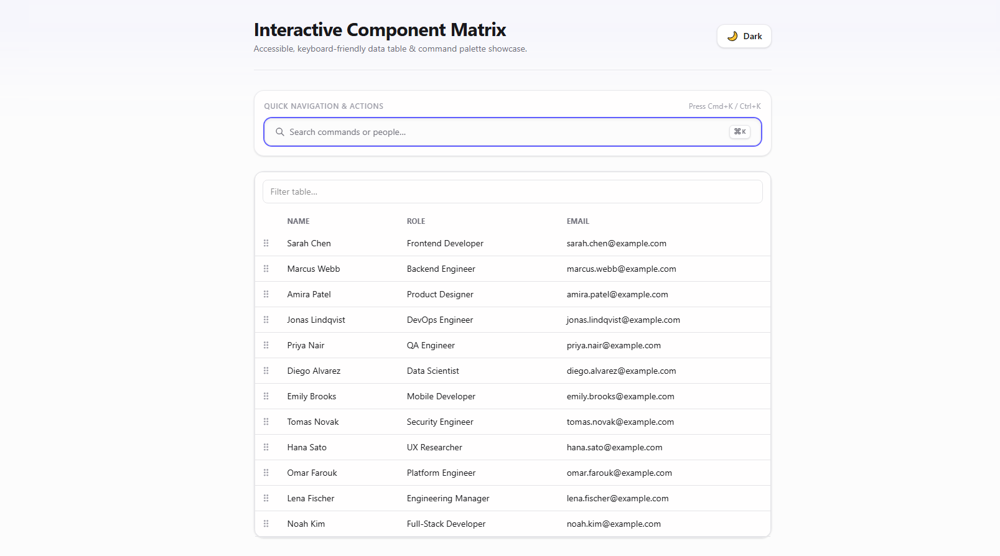

# 🎛️ Interactive Component Matrix

<div align="center">

  <p>An interactive, accessible, and high-performance UI data matrix featuring Command Palette quick actions, keyboard-driven navigation, and drag-and-drop reordering.</p>

  [](https://interactive-component-matrix-omega.vercel.app/)
  [](LICENSE)
  [](https://react.dev/)
  [](https://www.typescriptlang.org/)
  [](https://tailwindcss.com/)
  [](https://vitejs.dev/)
  
  <a href="https://interactive-component-matrix-omega.vercel.app/"><strong>Explore the Live Demo »</strong></a>

</div>

<p align="center">
  
</p>

---

## 📌 Overview

**Interactive Component Matrix** is a modern frontend interface focused on dynamic data presentation and power-user workflows. It combines a structured, responsive component matrix with keyboard-first ergonomics (Command Palette) and accessible interactive controls, offering a seamless and accessible experience for complex dashboard systems.

---

## ✨ Features

- **⚡ Quick Command Palette (`Cmd+K` / `Ctrl+K`):** Fast keyboard navigation and quick-action menu allowing users to search and execute commands instantly without leaving the keyboard.
- **🔄 Interactive Drag & Drop Reordering:** Accessible drag-and-drop interface powered by dnd-kit supporting both mouse interactions and full keyboard controls (`Space` to pick up/drop, `Arrow keys` to move, `Escape` to cancel).
- **📊 Dynamic Matrix View:** High-performance tabular matrix rendering team members, roles, and contextual contact data with responsive layouts.
- **♿ Accessibility (a11y) First:** Built with full ARIA live announcements, Radix UI primitive dialogs, screen-reader support, and strict keyboard focus management.
- **🔒 Type-Safe Data Flow:** End-to-end TypeScript architecture ensuring deterministic state handling, strict prop contracts, and maintainable component boundaries.
- **🎨 Modern Dark/Light UI:** Polished interface crafted with Tailwind CSS and Framer Motion for clean contrast, fluid micro-interactions, and responsive viewports.
---

## 🚀 Tech Stack

- **Frontend Framework:** [React 19](https://react.dev/)
- **Build Tool:** [Vite](https://vitejs.dev/)
- **Language:** [TypeScript 5.x](https://www.typescriptlang.org/)
- **Styling & Animations:** [Tailwind CSS](https://tailwindcss.com/), [Framer Motion](https://www.framer.com/motion/)
- **DnD & UI Primitives:** [@dnd-kit](https://dndkit.com/), [@radix-ui/react-dialog](https://www.radix-ui.com/)
- **Deployment:** [Vercel](https://vercel.com/)
- **Workflow & AI Acceleration:** Designed with modern AI-assisted engineering practices for rapid schema prototyping, edge-case generation, and a11y keyboard scenario validation.

---

## 🖥️ How It Works

1. **Navigate & Search:** Press `Cmd + K` (macOS) or `Ctrl + K` (Windows/Linux) to bring up the command palette for quick searching and trigger actions.
2. **Reorder Items:** 
   - **Using Mouse:** Drag rows/cards directly into their target positions.
   - **Using Keyboard:** Focus an item and press `Space` to pick up, navigate with `Arrow Up/Down`, and press `Space` again to drop.
3. **Inspect Matrix Data:** Interact with matrix rows and filterable metadata smoothly with immediate state feedback.

---

## 🛠️ Getting Started

Follow these steps to run the project locally:

### Prerequisites

- **Node.js:** `v18.0.0` or higher
- **Package Manager:** `npm`, `yarn`, or `pnpm`

### Installation & Run

1. **Clone the repository:**
```bash
git clone https://github.com/fmadihi/interactive-component-matrix.git
cd interactive-component-matrix
npm install
```

### 📂 Project Structure

```
interactive-component-matrix/
├── public/                 # Static assets & icons
├── src/
│   ├── assets/             # Images and SVG media
│   ├── components/         # Modular components (CommandPalette, MatrixTable, DndContext)
│   ├── types/              # TypeScript schemas, matrix models & action types
│   ├── App.tsx             # Main dashboard shell & global event listeners
│   ├── main.tsx            # React application root
│   └── index.css           # Tailwind base styles and theme directives
├── package.json
├── tailwind.config.js
├── tsconfig.json
└── vite.config.ts
```

---

## ⚒️ Development Notes

> **AI-Assisted Development:** This project was developed with the assistance of AI coding tools for faster prototyping and edge-case generation. All core logic, state management, accessibility decisions, and performance optimizations were reviewed and refined by the developer.

---

## 👩‍💻 Author

**Fatemeh Madihi** — Frontend Developer

- **Website:** [fatemehmadihi.ir](https://www.fatemehmadihi.ir)
- **GitHub:** [@fmadihi](https://github.com/fmadihi)
- **LinkedIn:** [Fatemeh Madihi](https://www.linkedin.com/in/fatemeh-madihi/)

- 
